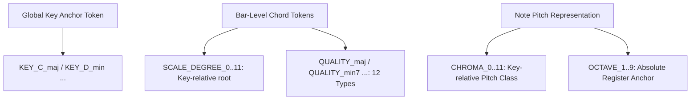
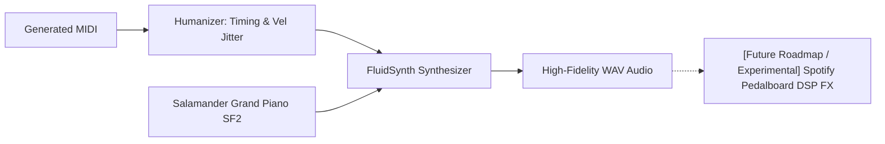

# 🎹 Real-Time AI Jam Station — Symbolic Transformer

> **Vocal melody → accompaniment generation via a symbolic (MIDI) decoder-only Transformer.**  
> 본 프로젝트는 보컬 멜로디(단선율) 입력을 기반으로 음악적으로 조화롭고 풍부한 다성부 피아노 반주를 실시간으로 생성하는 디코더 전용(Decoder-only) 트랜스포머 모델입니다.

---

## 목차

- [1. Background & Paradigm Shift: Why Symbolic?](#-1-background--paradigm-shift-why-symbolic)
- [2. Key Architecture & Design Innovations](#-2-key-architecture--design-innovations)
- [3. Development History & Troubleshooting (기술적 한계 극복 과정)](#-3-development-history--troubleshooting-기술적-한계-극복-과정)
- [4. Academic Evaluation & Metrics Framework](#-4-academic-evaluation--metrics-framework)
- [5. Pluggable Registry System: Extensibility](#-5-pluggable-registry-system-extensibility)
- [6. Comparative Landscape & Technical Analysis](#-6-comparative-landscape--technical-analysis-차별점-및-한계-분석)
- [7. main 브랜치 대비 핵심 설계 변경](#-7-main-브랜치-대비-핵심-설계-변경-branch-design-changes)
- [부록: 노출 편향 진단과 교정](#부록-멜로디-조건부-반주-생성--노출-편향-진단과-교정)

---

## 🚀 1. Background & Paradigm Shift: Why Symbolic?

이전 버전의 시스템은 보컬의 오디오 스펙트로그램(Log-Mel Spectrogram)을 입력받아 반주 스펙트로그램을 직접 예측하는 **Pix2Pix 스타일의 cGAN** 구조를 취했습니다. 하지만 이 방식은 다음과 같은 치명적인 한계에 직면했습니다:

1. **One-to-Many(일대다) 모호성**: 하나의 멜로디에 어울리는 반주는 무한히 존재합니다. L1 회귀 손실(Regression Loss)이 포함된 오디오 판별기 구조에서는 생성기가 여러 가능성의 스펙트로그램을 **"평균화"**하게 만들어 결국 뭉개지고 건조한(Blurry & collapsed) 스펙트로그램만을 출력하며 학습이 `val_L1 ≈ 0.25` 수준에서 정체되었습니다.
2. **비효율적인 차원**: 오디오 신호는 노이즈와 아티팩트가 많아 음악적인 규칙(화성학, 리듬)을 추상화하여 학습하기 어렵습니다.

### 💡 The Pivot (심볼릭으로의 패러다임 전환)
본 프로젝트는 소리를 직접 다루는 대신 음악의 추상적 기호인 **MIDI(Symbolic)** 영역으로 피벗하였습니다.
* **조건(Condition)**: 입력 보컬 멜로디의 음높이(Pitch), 음장(Duration), 마디 내 위치(Bar/Position) 정보가 토큰화되어 제공됩니다.
* **대상(Target)**: 모델은 이에 반응하여 피아노의 음높이, 음색, 벨로시티(Velocity) 등을 오토레그레시브(Autoregressive)하게 디코딩합니다.
* **이점**: 크로스 엔트로피(Cross-Entropy) 손실 함수를 통한 확실한 확률적 확률 모델링을 적용하여 다양하면서도 음악적 문법을 정확히 준수하는 풍부한 반주를 실시간(KV-cached decoding)으로 생성합니다.

---

## 🏗️ 2. Key Architecture & Design Innovations

학습 정체와 단선율 생성 문제(반주가 단조롭고 얇게 나오는 현상)를 완벽히 극복하기 위해 설계된 핵심 기술적 혁신들입니다.

### A. 상대적 화성 부호화 (Relative Harmonic Encoding) & Chord Tokens
데이터 증강 시 조옮김(Transposition)을 수행하면 절대적인 음높이(Pitch) 토큰은 바뀌지만, 곡의 조성(Key)과 코드 진행(Chord Progression) 간의 **상대적 음악 구조**는 유지되어야 합니다. 이를 완벽하게 지원하기 위해 새로운 토큰 시스템을 설계했습니다.



#### 🎵 시퀀스 그래머 (Sequence Grammar Layout)
생성된 토큰 시퀀스는 다음과 같이 고도로 정형화된 문법 구조를 가집니다:

```
<BOS>  KEY_C_maj  TEMPO_8
  BAR  [SCALE_DEGREE_0  QUALITY_maj]                              ← 마디 공유 화음 (두 트랙 동일 적용)
  POS_0
    TRACK_melody        CHROMA_0  OCTAVE_5  DUR_4  VEL_24        ← 조건 (condition, 손실 제외)
    TRACK_accompaniment CHROMA_0  OCTAVE_3  DUR_8  VEL_18        ← 타깃 (target, 손실 적용)
    TRACK_accompaniment CHROMA_4  OCTAVE_3  DUR_8  VEL_16        ← 다성부 화음 적층 (Polyphony)
  POS_8
    TRACK_melody        CHROMA_4  OCTAVE_5  DUR_4  VEL_20  ...
    ...
  BAR  [CHORD_N]  ...
<EOS>
```

* **KEY**: 전역 조성 정보(24개 variant)를 첫머리에 제공하여 화성적 기준점을 제공합니다.
* **CHORD_N**: 코드가 없거나 식별되지 않는 마디를 위한 플레이스홀더 토큰입니다.
* **Temporal Interleaving**: 멜로디와 반주 토큰을 `<SEP>` 없이 POS 단위로 인터리빙합니다. 각 박자에서 `TRACK_melody` 음표가 먼저 나오고 `TRACK_accompaniment` 음표가 바로 뒤를 따르므로, 모델은 반주를 예측할 때 동일 시간에 발생하는 멜로디 맥락에 인과적으로 직접 접근할 수 있습니다.
* **relative Pitch**: 음높이를 절대값이 아닌 key-relative `CHROMA`와 절대 옥타브 `OCTAVE`로 쪼개어, 조옮김 시 `CHROMA`와 `SCALE_DEGREE`는 완벽히 불변으로 유지하고 `KEY`와 `OCTAVE`만 미세 조정하도록 데이터 증강 계약(Contract)을 보장합니다.

---

### B. 오토레그레시브 다성부 해킹 (Structural Suppression / Polyphony Hack)
트랜스포머 언어 모델은 일반적으로 시퀀스상에서 "한번에 하나의 음표"를 출력하려 합니다. 반주가 피아노 화음을 연주해야 할 때, 모델은 마지막 Note의 속성인 `VEL_*` 토큰을 예측한 뒤 **다음 두 가지 기로**에 서게 됩니다:

1. **화음 쌓기 (Polyphony)**: 현재 시간 위치(`POS_n`)에 또 다른 음표(`CHROMA_*`)를 올려 동시에 소리 나게 함.
2. **시간 진행 (Monophony)**: 다음 시간으로 건너뛰어 다음 박자(`POS_n+1`)나 마디(`BAR`) 토큰을 생성함.

모델이 화음을 쌓지 않고 자꾸 시간만 진행시키려는 단선율 고착화(Sparse generation) 문제를 제어하기 위해 **추론 제어 파라미터(Inference Control Variable)**를 도입했습니다.

$$\text{If } t_{\text{last}} \in \mathbf{V}_{\text{velocity}}:$$
$$\mathbf{L}_{\text{next}}[\mathbf{I}_{\text{struct}}] \leftarrow \mathbf{L}_{\text{next}}[\mathbf{I}_{\text{struct}}] - \gamma_{\text{suppress}}$$

* **작동 원리**: 마지막 샘플링된 토큰 $t_{\text{last}}$가 벨로시티 토큰 집합 $\mathbf{V}_{\text{velocity}}$ (`VEL_*` 계열)에 속할 때, 다음 토큰 예측 Logits인 $\mathbf{L}_{\text{next}}$에서 시간/구조 관련 토큰 인덱스 $\mathbf{I}_{\text{struct}}$ (`BAR`, `POS_*`, `TEMPO_*`, `TRACK_*` 등)의 값을 일정한 벌점 파라미터 $\gamma_{\text{suppress}}$ (설정값 `structural_suppression`)만큼 차감합니다.
* **기본값**: `structural_suppression: 0.0` (비활성). 아래의 `polyphony_loss_boost`로 다성부를 충분히 학습한 모델에서는 추론 시 이 보정이 필요 없습니다. 모델이 단선율로 수렴하는 경향이 관찰될 경우 1.0~2.0으로 활성화하세요.
* **효과**: 모델이 시간 축을 진행시키는 것을 인위적으로 억제하여, 동일한 POS 위치에 여러 음표(화음)를 겹쳐서 적층 생성하도록 유도합니다. 이 수치는 CLI나 YAML 설정을 통해 결정론적으로 조절이 가능합니다.

#### 🎸 학습 시 다성부 강화 (Polyphony Loss Boost)
추론 시 패널티에만 의존하는 대신, **학습 단계에서 직접 다성부 생성을 강화**합니다.
* `polyphony_loss_boost: 2.0` — 화음 위치의 PITCH/VEL 토큰에 cross-entropy 손실 가중치 2배를 적용합니다.
* 모델이 스스로 화음을 쌓는 것을 학습하므로 추론 시 `structural_suppression`이 필요하지 않습니다. `structural_suppression`은 만약 생성물이 여전히 단선율로 관찰될 때의 최후 수단으로만 남겨 둡니다.

---

### C. 분류기 없는 가이드라인 (Classifier-Free Guidance, CFG) — ✅ 구현됨

Temporal Interleaving 포맷에서도 CFG를 **추론 시점에 지원**합니다 (이전엔 미지원으로 분류됐으나 구현 완료).

* **학습 시**: `condition_dropout_prob: 0.075` 확률로 **한 청크의 모든 블록 멜로디**를 `<PAD>`로 교체하여 무조건부 배포 $P(\text{accom})$와 조건부 배포 $P(\text{accom} \mid \text{melody})$를 함께 학습합니다. (과거엔 첫 블록만 PAD하는 버그가 있었으나 전체 블록 PAD로 수정 → 진짜 무조건부 모드 학습.)
* **추론 시**: `generate_accompaniment`이 멜로디를 PAD한 무조건부 분기를 cond와 한 배치(2-row)로 동시에 forward하여 logits를 블렌딩합니다 (`cfg_w` 파라미터, app 슬라이더).

$$\mathbf{L}_{\text{cfg}} = \mathbf{L}_{\text{uncond}} + w \times (\mathbf{L}_{\text{cond}} - \mathbf{L}_{\text{uncond}})$$

* **가이드라인 강도($w$, `cfg_w`)**:
  * `w = 0.0`: 비활성 (단일 분기, 추론 비용 1×).
  * `w = 1.0`: 기본 조건부와 동일.
  * `w > 1.0` (주로 1.5~3.0): 멜로디 화성·박자에 반주가 더 강하게 밀착. (cond+uncond 동시 forward로 추론 2×)

### C-2. 화성 기피음 소프트 페널티 (Avoid-note Soft Penalty) — ✅ 구현됨

재학습 없이 추론 시점에 화성 충돌을 억제합니다. 모델이 생성한 코드(SCALE_DEGREE+QUALITY)를 실시간 추적하여, 그에 대한 **기피음**(예: 메이저 3도 위의 11음)에 해당하는 `CHROMA` logit을 부드럽게 감점합니다 (`avoid_note_penalty`, app 슬라이더). Hard mask가 아니라 soft penalty라 텐션·경과음 같은 색채음은 보존됩니다.

---

### D. 고품질 오디오 렌더링 (FluidSynth & Humanizer) 및 DSP 로드맵
AI가 MIDI 파일(심볼릭 데이터)을 아무리 훌륭하게 작곡해도, 렌더링된 사운드가 메마르고 기계적이면 사용자 경험(UX)이 극도로 저하됩니다. 이를 위해 고음질 음향 신호 처리 파이프라인을 구축했습니다.



1. **Humanizer (핵심 구현)**: 기계적인 정박 연주를 피하기 위해 미세한 릴리즈 시간 및 벨로시티 노이즈(`velocity_std: 6`, `timing_std_ms: 8.0`, `duration_std_ms: 5.0`)를 주입하여 인간 연주자 고유의 흔들림을 재현합니다. (코어 추론 스크립트에 탑재 완료)
2. **Premium Samples (핵심 구현)**: 16개 벨로시티 레이어를 지닌 전문가급 피아노 샘플 라이브러리(`Salamander Grand Piano.sf2` 등)를 FluidSynth로 마운트하여 기계적 신디사이저가 아닌 어쿠스틱 피아노 소리를 렌더링합니다.
3. **Spotify Pedalboard DSP (실험적 지원 및 로드맵)**:
   * Reverb(공간감), Compressor(다이내믹 피크 제어), Limiter(클리핑 방지)로 구성된 전문가용 DSP 체인입니다.
   * **현재 구현 상태**: 메인 코어의 결합 복잡성을 배제하기 위해 코어 라이브러리에서는 FluidSynth 기반 렌더링만 수행하며, Spotify `Pedalboard` DSP 체인은 **비교 평가 실행기(`scripts/compare_inference.py`)에서 패키지가 로컬 환경에 설치되어 있을 시 옵션으로 작동하는 실험적 기능**으로 구축해 두었습니다. 향후 코어의 기본 탑재 파이프라인으로 승격될 예정입니다.

---

## 📜 3. Development History & Troubleshooting (기술적 한계 극복 과정)

본 프로젝트의 M2A(Melody-to-Accompaniment) 모델은 오디오 생성의 한계를 극복하고 심볼릭 생성으로 전환한 뒤에도, 딥러닝과 자기회귀(Autoregressive) 생성 모델의 본질적인 한계점들을 단계적으로 극복하며 발전했습니다. 다음은 그 핵심적인 기술적 진화 과정입니다.

### Phase 1: 패러다임 전환 및 토큰 구조 설계
* **문제 인식**: Raw 오디오 파형은 시계열 데이터로서 너무 길어 다루기 어렵고, Mel-spectrogram 기반의 생성 방식은 위상 손실(Phase Loss) 문제와 더불어 일대다(One-to-Many) 맵핑의 모호성으로 인해 스펙트로그램이 뭉개지는 회귀 붕괴 현상이 치명적이었습니다.
* **해결 (Symbolic 전환 및 화성/리듬 분리)**: 오디오 대신 기호화된 악보 데이터인 MIDI를 Transformer로 생성하는 방향으로 피벗(Pivot)했습니다. 
  * **화성적 부호화**: 음악이 조옮김(Key Shift)에 대해 동형적(Isomorphic)이라는 점에 착안, 코드(Chord)와 상대적 음도(Chroma)를 분리 표현하여 Key Shift에 대해 불변(Invariant)하도록 토큰을 설계했습니다.
  * **리듬적 부호화**: 1마디를 16분절 단위(16th notes grid)로 분할하여 특정 위치(Position)에 노트(Note)를 쌓을 수 있는 격자 구조를 채택했습니다.

### Phase 2: 장기 기억력 한계와 Temporal Interleaving
* **문제 발생**: 초기 학습 시 멜로디 시퀀스 전체를 입력받은 후 반주 시퀀스를 통째로 생성하도록 설계했으나, 컨텍스트가 길어지며 모델의 장기 기억력(Long-term memory) 저하로 인해 생성된 반주가 직전 멜로디의 화성적 맥락을 제대로 추적하지 못했습니다.
* **해결**: 멜로디와 반주 토큰을 분리하지 않고 동일한 시간적 위치(Position)에서 교대로 등장하게 묶는 **시간적 인터리빙(Temporal Interleaving)** 포맷을 도입했습니다. 이를 통해 모델이 반주를 예측할 때 동시간대의 멜로디를 즉각적으로 추적(Causal Tracking)할 수 있도록 구조를 변경했습니다.

### Phase 3: 단선율 고착화 문제와 Polyphony Hack
* **문제 발생**: Temporal Interleaving 도입 후, 모델이 동일한 Position 내에서 여러 화음을 쌓지 못하고 오로지 시간 축(Next Position)으로만 전진하려는 단선율 고착 문제가 관찰되었습니다.
* **해결**: 학습 시 다성부 생성을 강제하기 위해 화음을 쌓는 위치(동일 Position 내 연속된 Note 생성)에 대한 손실 가중치를 2배(`polyphony_loss_boost`)로 상향 조정하여, 모델이 자발적으로 다성부 반주 구조를 학습하도록 유도했습니다.

### Phase 4: 노출 편향(Exposure Bias)과 1박자 붕괴 현상 극복
* **문제 발생**: 다성부 반주 생성을 유도한 결과, 모델이 1박자에 모든 코드를 쏟아내고 이후 2~4박자 구간에서는 어떠한 음도 생성하지 못하는 **붕괴(Beat-1 Collapse) 현상**이 발생했습니다. 정답을 제공하는 교사 강요(Teacher-forcing) 기반의 학습 평가 지표(`val_loss`)상에서는 모델이 정상적으로 작동하는 것처럼 보였으나, 실제 자기회귀(Autoregressive) 생성 환경에서는 스스로의 오차가 누적되며 붕괴되는 노출 편향(Exposure Bias) 문제가 확인되었습니다.
* **해결**:
  1. **독자적 진단 도구 개발**: 기존 `val_loss`가 리듬적 관점에서 무의미하다고 판단, 1마디 내 음의 분산도를 측정하는 새로운 자기회귀 기반 진단 도구를 생성했습니다.
  2. **Scheduled Sampling 도입**: 학습 중 모델 자신이 예측한 값을 다음 스텝의 입력으로 다시 제공하는 스케줄드 샘플링을 도입하여, 모델이 추론 시 발생하는 자체 오차에서 스스로 회복하도록 추가적인 파인튜닝(Fine-tuning)을 수행했습니다.
  3. **A/B 테스트 기반 가중치 선정**: 매 에포크마다 음악을 실제 생성한 뒤 새로운 진단 도구를 통해 분산도를 1차 필터링하고, 적절한 분산을 가진 가중치를 대상으로 정성적 청음(A/B 테스트)을 거쳐 최종 체크포인트를 결정했습니다.

---

## 📊 4. Academic Evaluation & Metrics Framework

모델의 음악적 수준을 객관적으로 입증하기 위해 설계된 종합 정량 평가 체계입니다. `scripts/analysis/compare_inference.py`를 실행하면 모든 결과가 테이블 및 그래프로 자동 요약됩니다.

| 평가 지표 (Metric) | 설명 | 측정 목적 |
| :--- | :--- | :--- |
| **Overlapping Area (OA)** | 실제 학습 셋과 생성 모델의 Pitch / Duration / Velocity 확률 분포 간의 교집합 면적을 측정 (0.0 ~ 1.0). | 모델의 확률론적 수렴 및 모사 완성도 입증 |
| **Pitch-Class Cosine Sim** | 생성된 피아노 반주의 12차원 Pitch-class 음높이 분포와 입력 멜로디의 분포 간 코사인 유사도를 측정. | 입력 멜로디와의 화성적 일치도(Harmony Alignment) 검증 |
| **Polyphony Rate** | 시간 노드 당 두 개 이상의 음표가 동시에 발생하는 확률(화음 비율). | 단선율 고착화 현상의 성공적 극복 증명 |
| **Onset Jaccard Similarity** | 실제 곡과 생성된 곡 간의 리듬 타격 시점(Onset Grid)의 합집합 대비 교집합 비율. | 리듬적 밀도와 그루브(Groove) 일치성 측정 |
| **Perplexity (PPL)** | 다음 토큰 예측의 불확실도 계수. 낮을수록 음악적 문법을 정확히 이해하고 있음을 뜻함. | 언어 모델링의 수치적 성능 보장 |

---

## 🔌 5. Pluggable Registry System: Extensibility

프로젝트 내부의 모든 핵심 컴포넌트(토크나이저, 모델, 옵티마이저, 스케줄러)는 데코레이터 패턴 기반의 레지스트리 시스템으로 캡슐화되어 있어, 다른 연구원들이 코드를 직접 수정하지 않고 설정 변경만으로 새로운 실험을 할 수 있습니다.

### 새로운 토크나이저 등록 예시:

```python
from m2a_transformer.tokenizer import BaseTokenizer, register_tokenizer

@register_tokenizer("my_super_tokenizer")
class MySuperTokenizer(BaseTokenizer):
    def __init__(self, cfg):
        super().__init__(cfg)
        # 자신만의 특수한 어휘집 및 부호화 문법 구현
        
    # 추상 메서드 구현...
```

---

## ⚖️ 6. Comparative Landscape & Technical Analysis (차별점 및 한계 분석)

본 프로젝트(**Symbolic Jam Transformer**)가 기존 AI 작곡 패러다임과 비교하여 가지는 고유한 가치와 개선점, 그리고 공학적 한계점을 엄격하게 요약합니다.

### A. 핵심 차별점 (Differentiation)
* **조-불변 상대적 하모닉 토크나이저**: 절대 음높이(MIDI Note 0~127) 대신 조성(`KEY`) 기준의 **상대적 음도(Scale Degree), 화음 종류(Chord Quality), 상대 크로마(Chroma) 및 옥타브 레지스터**로 음높이를 해체 인코딩했습니다. 조옮김 transposition 시에도 핵심 토큰 구조가 100% 동일하게 불변(Invariant)하여 학습 데이터 효율과 화성적 안정성을 혁신했습니다.
* **실시간 인터랙티브 상호작용**: 고정된 길이를 오프라인 보간하는 VAE(MusicVAE)와 달리, Causal Self-Attention 단일 디코더 상에서 멜로디 조건(Condition Prefix) 하에 실시간 즉흥 반주 디코딩을 가능하게 합니다.
* **디코딩 시점 다성부 제어**: 재학습이나 매개변수 수정 없이, 추론 시점의 `structural_suppression` 패널티 차감 조작만으로 화음 밀도(Polyphony Rate)를 결정론적으로 동적 조절할 수 있습니다.

### B. 기술적 개선점 (Improvements)
* **회귀 붕괴 극복**: 기존 cGAN 스펙트로그램 직접 매핑 모델의 One-to-Many 모호성으로 인한 흐릿한(blurry) 평균치 수렴 붕괴를 극복하고, 심볼릭 토큰 크로스 엔트로피 분류 체계로 선명하고 정확한 화성을 작곡합니다.
* **초경량 최적화**: 수억~수십억 파라미터를 소모하는 EnCodec 기반 오디오 토큰 모델(MusicGen 등)과 달리, 단 **38M 파라미터**의 정제된 Transformer 아키텍처를 구현하고 RoPE 및 Gradient Checkpointing을 결합하여 무료 Colab GPU(T4) 혹은 저사양 로컬 환경에서 단 2-3시간 만에 고속 학습 수렴이 가능하게 만들었습니다.
* **토큰 무결성 검사**: 전처리 시 `_dataset_meta.json`에 기록된 토크나이저 해시값(Fingerprint)을 로딩 즉시 대조함으로써, 설정 drift로 인한 학습 오류 및 CUDA 충돌 문제를 100% 미연에 차단합니다.
* **소스 균형 샘플링 (Source-Balanced Sampling)**: 자연 분포(현재 chunk 기준 Lakh ≈89% / Slakh ≈8% / POP909 ≈3%)를 목표 분포(Lakh 55% / Slakh 40% / POP909 5%)로 재조정하는 `WeightedRandomSampler`를 도입했습니다. 전문 편곡 품질의 Slakh를 **약 4.9배 오버샘플링**하여 화음 품질을 높이고, 중국 팝 장르 편향이 있는 POP909는 낮게 고정합니다.

### C. 냉정한 한계점 (Limitations)
* **음원 합성 품질의 사운드폰트 의존성**: 물리적 오디오를 생성하지 않고 작곡 기호(MIDI)를 출력하기 때문에, 최종 WAV의 음질 및 Realism이 로드된 외부 사운드폰트(`.sf2`)의 음색에 절대적으로 종속됩니다.
* **시간 양자화 그리드 제약**: 16분 음표 그리드 시스템의 한계로 인해 생성 단독으로 스윙(Swing), 엇박자 그루브, 루바토(Rubato) 같은 유연한 인간적 시간 그루브를 작곡하는 능력이 구조적으로 배제되어 있습니다 (Humanizer 후처리로 보완).
* **로컬 컨텍스트 윈도우 한계**: `max_seq_len: 2560` 제한으로 인해 대략 12~16마디 내의 맥락은 대위법적으로 영리하게 추적하지만, 곡 전체(Verse → Chorus → Outro)를 아우르는 거시적인 장기 의존성 구조를 일관성 있게 조율하는 장기 기억에는 한계가 있습니다.

---

## 🔀 7. main 브랜치 대비 핵심 설계 변경 (Branch Design Changes)

`feat/single-stream-accompaniment` 브랜치는 main 브랜치에서 다음과 같은 구조적 설계 변경을 적용했습니다.

| 구분 | main 브랜치 | 현재 브랜치 |
| :--- | :--- | :--- |
| **트랙 구조** | 3트랙: melody + bridge + piano | 2트랙: melody + accompaniment |
| **시퀀스 포맷** | SEP-분리형 (melody 블록 → `<SEP>` → piano 블록) | Temporal Interleaving (POS 단위 인터리빙, SEP 미발행) |
| **어휘 크기** | 174 토큰 (TRACK_bridge 포함) | 173 토큰 |
| **최대 시퀀스 길이** | 2048 토큰 | 2560 토큰 |
| **다성부 제어 전략** | `structural_suppression: 1.5` (추론 시 항상 활성) | `polyphony_loss_boost: 2.0` (학습으로 근본 해결); `structural_suppression: 0.0` (비활성) |
| **CFG 추론** | 지원 (`condition_dropout_prob: 0.15`) | ✅ 지원 (cond/uncond 2-row 블렌딩 `cfg_w`); dropout `0.075` (전체 블록 PAD) |
| **데이터 샘플링** | 균등 (자연 분포) | `WeightedRandomSampler`: Slakh ×4.9 / Lakh ×0.62 / POP909 ×1.8 (목표 55/40/5) |
| **Train/Val 분할** | 스트라이드 기반 인덱스 | SHA-256 곡 단위 분할 (`val_ratio: 0.2`, 데이터 누수 차단) |
| **Checkpoint 주기** | 100 steps (I/O 병목) | 1000 steps |
| **멜로디 밀도 필터** | 없음 | `min_melody_coverage: 0.20` (저커버리지 곡 자동 제거) |

---

> **2026-05-31 갱신 요약**: 데이터 재전처리(Slakh redux 1,710 → 18,161 shard), Slakh 멜로디 추출
> 캐스케이드(instrument GT → miner → weight), 소스 가중치 55/40/5 재교정, condition-dropout 전체
> 블록 PAD 수정(0.075), **CFG 추론 구현**(`cfg_w`), **avoid-note soft penalty**(`avoid_note_penalty`),
> RAM 티어 LRU 셔드 캐시.

**최종 업데이트:** 2026-05-31  
**프로젝트 주제:** 상징적 피아노 반주 생성을 위한 디코더 트랜스포머 및 추론 성능 고도화 시스템

---

## 부록: 멜로디 조건부 반주 생성 — 노출 편향 진단과 교정

### 1. 개요

**과제.** 멜로디(MIDI)가 주어졌을 때 어울리는 **반주**를 생성하는 모델을 만든다.
음악을 토큰열로 표현하고(symbolic music), 디코더-온리 Transformer로 다음 토큰을
자기회귀적으로 예측한다.

**모델.** 디코더-온리 Transformer, 약 **37.9M** 파라미터.

| 항목 | 값 |
|---|---|
| d_model / layers / heads / d_ff | 512 / 12 / 8 / 2048 |
| 위치 인코딩 | RoPE (회전 위치 임베딩) |
| 입출력 임베딩 | tie_weights |
| vocab / max_seq | 173 / 2560 |
| attention | FlashAttention (SDPA, causal) |

**표현 (토크나이저).** REMI 계열. 한 곡을 **bar-block 인터리빙**으로 배치한다 —
각 블록은 `[멜로디 마디] → SEP → [반주 마디]` 순서라, 모델은 그 마디의 멜로디 전체를 본 뒤
반주를 생성한다. 음정은 **키-상대 화성 인코딩**(CHROMA/OCTAVE + SCALE_DEGREE/QUALITY/KEY)을
사용해 조성 일반화를 돕는다. 한 마디는 16분음표 격자(positions_per_bar=16)로 양자화한다.

**데이터.** POP909(클린 팝 피아노 반주) + Slakh(합성 멀티트랙) + Lakh(대규모 잡다 MIDI).
코퍼스별 가중 샘플링(`WeightedRandomSampler`)으로 노출 비율을 조절한다.

---

### 2. 문제 발견: "beat-1 collapse"

학습된 모델의 반주를 들어보면 **모든 코드를 한 박(주로 1박)에 몰아치고 나머지는 쉬는**,
기계적이고 정체된 연주가 나왔다. 아르페지오 후처리로 가릴 수는 있었지만, 그것은
규칙 기반 변환이라 "Transformer가 만든 음악"이라는 목표와 어긋났다.

핵심 질문: **이게 학습(분포)의 문제인가, 생성(추론)의 문제인가?**

---

### 3. 진단: 표준 지표의 맹점

#### 3.1 teacher-forced 지표는 문제를 못 본다

학습 중 측정한 `val_loss`와 리듬/화성 지표는 모두 **teacher forcing**(정답 직전 토큰을
입력으로 줌) 기준이었다. 이 기준으로는 모델이 **완벽히 정상**으로 보였다:

| 지표 (teacher-forced) | 모델 | GT |
|---|---|---|
| 1박 집중도 (pos0_share) | 0.11 | 0.11 |
| 박자 엔트로피 (pos_entropy) | 2.63 | 2.64 |
| 화성 다양성 (chroma_entropy) | 2.43 | 2.43 |

40 epoch 내내 이 값들은 **평평**했다. 즉 모델의 *조건부 분포*는 옳다.

#### 3.2 자기회귀 진단 도구

실제 추론은 모델이 **자기 출력을 다시 입력으로** 먹는다(자기회귀). 그래서 동일 모델로
실제 생성을 돌리고 그 *생성물*의 통계를 GT와 비교하는 진단을 구현했다
(`scripts/analysis/generation_rhythm_stats.py`). 측정 지표:

- `pos0_share` — 온셋이 1박에 쏠린 정도 (collapse ↑)
- `pos_entropy` — 16칸에 걸친 온셋 분산 (collapse ↓)
- `back_half_share` — 마디 후반부(8~15칸) 온셋 비율 (front-loading ↓이면 낮음)
- `stack_rate` — 같은 위치에 음을 쌓는 비율 (클러스터 ↑)
- `chroma_entropy` — 음정 클래스 다양성 (화성 빈약 ↓)

#### 3.3 결과: 문제는 생성 시 누적되는 **노출 편향**

| | teacher-forced | autoregressive(실제 생성) |
|---|---|---|
| 초기 모델 pos0 | 0.11 (정상) | **0.40 (붕괴)** |
| 초기 모델 pos_entropy | 2.63 | **1.18** |
| 초기 모델 stack_rate | — | **0.92 (떡칠)** |

teacher-forced에선 멀쩡한데 자기회귀에선 무너진다 — 전형적 **exposure bias**.
모델은 정답 문맥이 주어지면 옳게 예측하지만, 자기 출력을 먹으면 작은 오차가 누적되어
퇴화 모드(1박 클러스터)로 빠진다. **표준 지표가 이 실패를 못 본 것이 1차 원인이었다.**

---

### 4. 해결 1: 손실 재설계 (1차)

초기 학습에는 화음 생성을 유도하는 polyphony 손실 부스트가 2.0(무제한)으로 걸려 있어
"한 위치에 무한정 쌓기"로 과교정되어 있었다. 이를 완화했다.

- `polyphony_loss_boost` 2.0 → **1.3** + **스택 깊이 캡**(max_stack=4): 화음은 유지하되 클러스터 억제.
- 리듬(POS, *언제* 치는가) 손실 가중치를 구조 토큰에서 분리해 상향(`loss_pos_weight=1.5`).

결과: teacher-forced collapse는 사라졌으나, **자기회귀 생성은 여전히 front-loaded**
(`back_half_share ≈ 0.11`, GT 0.51) — 바 앞 1/3에 온셋을 몰고 뒤를 비웠다. teacher-forced
손실만으로는 자기회귀 행동을 못 고친다는 점이 재확인되었다.

---

### 5. 해결 2: 데이터 재구성 + 스케줄드 샘플링 (제출 모델)

진단이 가리킨 두 축을 동시에 손봤다. **collapse를 고친 체크포인트에서 워밍스타트.**

#### 5.1 데이터 — 무엇을 배우는가
- **Lakh 제거**(대규모·이질적 → "평균적이고 밍밍한" 반주의 주범).
- **POP909 60 / Slakh 40**(클린한 팝 컴핑 위주 + Slakh로 화성 다양성/망각 방지).
- 가중치 0인 코퍼스가 epoch 길이를 부풀리지 않도록 **에폭 크기를 활성 청크로 보정**.

#### 5.2 학습 방법 — 어떻게 배우는가 (핵심)
**스케줄드 샘플링**(Bengio et al., 2015)으로 노출 편향을 정조준했다. 학습 중 반주
입력 토큰의 일부를 **모델 자신의 예측**으로 치환(확률 *p*, epoch 1부터 0→0.25로 6 epoch
점증)하여, 모델이 *자기 출력으로부터 회복*하는 법을 학습하게 했다. 멜로디(조건) 토큰은
건드리지 않는다. `p=0`이면 기존 teacher forcing과 동일(안전장치).

#### 5.3 그 외
- 워밍스타트용 LR을 3e-4 → **1e-4**로 낮춰(처음부터 학습용 LR이 좋은 가중치를 망치는 것 방지),
  40 epoch에 걸쳐 코사인 감쇠.
- `val_loss`가 목표(그루브)에 무력하므로 **전 epoch 체크포인트를 보존**하고, 선택은
  자기회귀 진단으로 했다.

---

### 6. 결과

POP909에 대한 **자기회귀 생성** 통계 (GT = 같은 곡의 원곡 반주).

| 모델 / 지표 | back_half | pos0 | pos_ent | stack | chroma | 상태 |
|---|---|---|---|---|---|---|
| **GT (목표)** | 0.51 | 0.085 | 2.33 | 0.50 | 1.90 | — |
| 초기(붕괴) | — | 0.40 | 1.18 | 0.92 | 1.78 | 🔴 beat-1 collapse |
| 1차(손실 수정) | 0.11 | 0.27 | 1.72 | 0.79 | 1.72 | ⚠️ front-loaded |
| **최종 ep7** | **0.40** | **0.147** | **2.33** | 0.66 | 1.87 | 🟢 리듬 복원+화성 보존 |
| 최종 ep15 | 0.32 | 0.150 | 2.28 | 0.60 | 2.04 | 🟢 화음 얇음+화성 풍부 |

**해석.**
- **front-loading 대폭 개선**: `back_half_share` 0.11 → 0.40 (GT 0.51 접근). 바 뒷부분이
  채워지며 "치고 쉬고"가 완화됨.
- **박자 분산 회복**: `pos_entropy` 1.18(붕괴) → 2.33(=GT).
- **화성 보존**: `chroma_entropy` ~1.9 유지(GT 1.90). 즉 *리듬을 복원하면서 화성을 잃지 않음* —
  목표 달성.
- 학습은 **초반(epoch 5~15)에 빠르게 수렴**, 후반은 개선 없이 화성만 약간 깎여 → best는 초반.

**부수 발견(방법론).** teacher-forced 지표는 전 epoch 평평해 선택에 무력했다. 만약 `val_loss`로
best를 골랐다면 잘못된 모델을 선택했을 것이다. **자기회귀 진단이 진단과 모델 선택 둘 다에서
결정적이었다.**

#### 6.1 추론 설정 sweep (생성 온도/top_p)

최종 모델(ep7)에 대해 같은 진단으로 생성 설정을 sweep했다. 동일 자기회귀 지표 기준.

| temperature | top_p | back_half | pos0 | pos_entropy | chroma |
|---|---|---|---|---|---|
| GT (목표) | — | 0.51 | 0.085 | 2.33 | 1.90 |
| 0.8 | 0.97 | 0.34 | 0.179 | 1.96 | 1.90 |
| 1.0 | 0.97 | 0.43 | 0.146 | 2.23 | 1.93 |
| **1.2** | **0.97** | **0.52** | **0.064** | 2.60 | 2.00 |
| 1.4 | 0.97 | 0.60 | 0.073 | 2.57 | 2.11 |

- **top_p 0.97이 0.92를 모든 온도에서 일관되게 능가**.
- **temp 1.2 / top_p 0.97에서 생성 분포가 GT에 가장 근접**(back_half 0.52≈0.51, pos0 0.06≈0.085).
  더 낮으면 바를 덜 채우고, 더 높으면(1.4) GT를 초과해 산만해진다.
- 따라서 기본 추론 설정을 **temp 1.2 / top_p 0.97**로 채택했다(`configs/config.yaml`).
- 한편 `stack_rate`(화음 두께)는 온도와 거의 무관(~0.65) — 온도로는 못 고치는 *학습된* 속성으로,
  §7의 향후 과제로 남는다.

---

### 7. 한계 및 향후 과제

- **화음 두께**: `stack_rate`가 0.66로 GT(0.50)보다 약간 두껍다. argmax 기반 스케줄드 샘플링의
  부분적 한계 — 추론과 동일한 *온도 샘플링* 기반 SS로 더 좁힐 수 있다.
- **멜로디 공백 구간**: 멜로디가 쉬거나 적은 구간에서 반주가 함께 얇아진다. 멜로디-조건
  설계의 본질적 특성. 근본 해결은 **코드 진행에 조건부**(멜로디가 쉬어도 화성 가이드가 지속)로
  생성 설계를 확장하는 것 — 토큰 포맷에 코드 토큰이 이미 있으므로 후속 작업으로 가능.
- 평가는 분포 근접도(필요조건)일 뿐, 최종 음악성은 청취로 확인해야 한다.

---

### 8. 결론

생성물의 "beat-1 collapse"는 학습 분포가 아니라 **추론 시 노출 편향**이 원인임을,
*자기회귀 진단*을 만들어 규명했다. 표준 `val_loss`/teacher-forced 지표는 이 실패에 눈이 멀어
진단·선택 모두에 무력했다. **데이터 재구성(POP909 중심) + 스케줄드 샘플링**으로 리듬을
복원(back_half 0.11→0.40, pos_entropy 1.18→2.33)하면서 화성(chroma ~1.9)을 보존했다.

이 작업의 핵심 교훈은, **자기회귀 생성 모델은 자기회귀 조건에서 측정·교정해야 한다**는 것이다.

